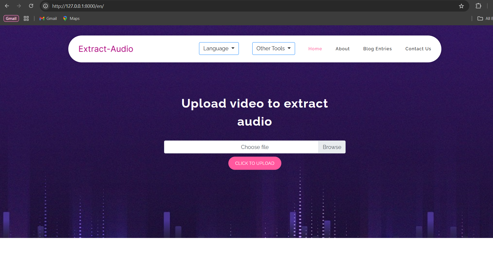

# Extract Audio  

Extract Audio is a Django-based web application that allows users to upload videos in various formats and convert them into MP3 files. The project supports multilingual functionality (4 languages) and processes video-to-audio conversion in the background using Celery and moviepy.  

---

## Features  

- **Video to MP3 Conversion**: Upload videos in multiple formats and convert them to MP3.  
- **Background Processing**: Uses Celery to handle video processing tasks in the background for a smooth user experience.  
- **Multilingual Support**: Supports 4 languages for a global audience.  
- **Responsive Design**: Built with Bootstrap for a clean and responsive user interface.  

---

## Technology Stack  

- **Backend**: Django  
- **Frontend**: Bootstrap  
- **Task Queue**: Celery  
- **Video Processing**: moviepy  
- **Broker**: Redis (used with Celery)  

---

## Installation  

### Prerequisites  

Ensure you have the following installed:  
- Python 3.8+  
- Redis  
- pip (Python package manager)  

### Steps  

1. Clone the repository:  
   ```bash  
   git clone https://github.com/MmdUnion/extract-audio.git  
   cd extract-audio  
   pip3 install -r requirements.txt
   python3 manage.py migrate
   python3 manage.py runserver
   ```
2. Open new terminal in the project folder:  
   ```bash  
   celery -A extract_audio worker -l info
   ```




